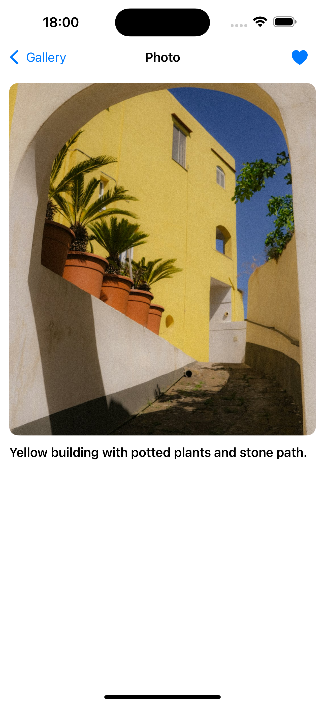
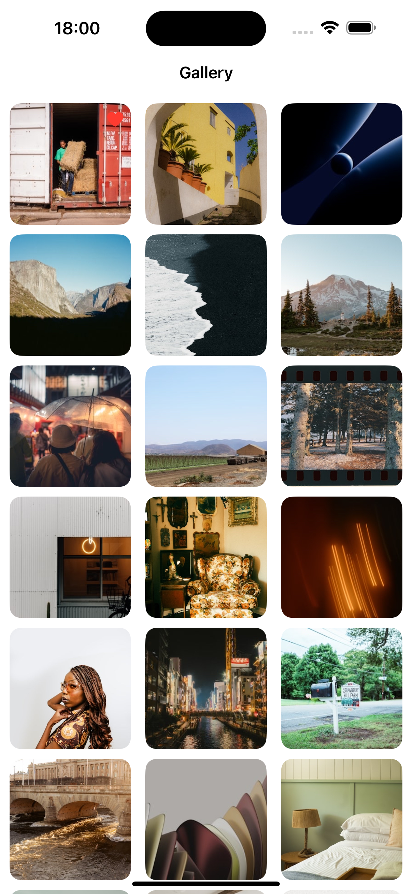

# GalleryApp (En)

**Contact:** Telegram: [@badrakova_13](https://t.me/badrakova_13)

## Overview
GalleryApp is an iOS app that displays photos from the Unsplash API as a grid gallery. Users can open a photo in a detail view, swipe between photos, and save favorites locally.

## Key Features
- Gallery grid of thumbnails
- Pagination (30 photos per request)
- Detail screen with swipe navigation
- Favorites:
  - toggle with a heart button
  - local persistence
  - favorite indicator in the gallery
- Image caching with Kingfisher

## Tech Stack
- Swift, iOS 15+
- UIKit
- URLSession networking layer
- Kingfisher (image loading & caching)
- SwiftLint

## Architecture
MVVM-style separation:
- `Presentation/` — ViewControllers, ViewModels, UI state, cells, detail scene
- `Data/` — networking (Unsplash client), models, favorites storage

## Configuration (Unsplash API / Secrets)
The app uses the API: `https://api.unsplash.com`

An Access Key is required for the app to work. The key is not stored in the repository and must be configured locally.
### 1) Create `Secrets.xcconfig`
Create `Secrets.xcconfig` in the repository root:
```xcconfig
UNSPLASH_ACCESS_KEY = YOUR_UNSPLASH_ACCESS_KEY
UNSPLASH_HOST = https://api.unsplash.com
```
### 2) Attach Secrets.xcconfig
PROJECT GalleryApp → Info → Configurations

- Debug → Secrets.xcconfig
- Release → Secrets.xcconfig
### 3) Add variables to Info.plist
 TARGETS GalleryApp → Info
```xcconfig
UNSPLASH_ACCESS_KEY (String) = $(UNSPLASH_ACCESS_KEY)
UNSPLASH_HOST (String) = $(UNSPLASH_HOST)
```

## Screenshots
### Gallery


### Detail


### Favorites


# GalleryApp (RU)

**Контакт:** Telegram: [@badrakova_13](https://t.me/badrakova_13)

## Обзор
GalleryApp — iOS-приложение, которое показывает фотографии из Unsplash API в виде сетки. Можно открыть фото в детальном экране, свайпать между фото и добавлять в избранное с локальным сохранением.

## Возможности
- Галерея (сетка превью)
- Пагинация (30 фото за запрос)
- Детальный экран + свайпы
- Избранное:
  - кнопка-сердце
  - локальное хранение
  - индикатор избранного в галерее
- Кэширование изображений через Kingfisher

## Стек
- Swift, iOS 15+
- UIKit
- URLSession (сетевой слой)
- Kingfisher (загрузка/кэширование)
- SwiftLint

## Архитектура
MVVM-подход с разделением по слоям:
- `Presentation/` — экраны, ViewModel, состояния, ячейки, detail scene
- `Data/` — сетевой слой (Unsplash client), модели, избранное

## Конфигурация (Unsplash API / Secrets)
Приложение использует API: `https://api.unsplash.com`

Для работы приложения нужен Access Key. Ключ не хранится в репозитории и настраивается локально.


### 1) Создайте `Secrets.xcconfig`
Создайте `Secrets.xcconfig` в корне репозитория со следующим содержимым:

```xcconfig
UNSPLASH_ACCESS_KEY = YOUR_UNSPLASH_ACCESS_KEY
UNSPLASH_HOST = https://api.unsplash.com
```
### 2) Подключите Secrets.xcconfig:
 PROJECT GalleryApp → Info → Configurations
- Debug → Secrets.xcconfig
- Release → Secrets.xcconfig
### 3) Добавьте переменные в Info.plist:
TARGETS GalleryApp → Info
- Добавьте два поля (Type: String)
```xcconfig
UNSPLASH_ACCESS_KEY (String) = $(UNSPLASH_ACCESS_KEY)
UNSPLASH_HOST (String) = $(UNSPLASH_HOST)
```
